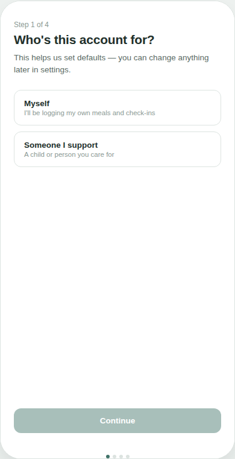
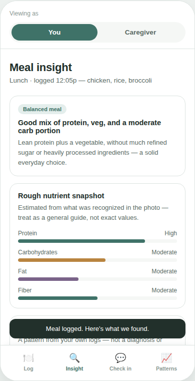
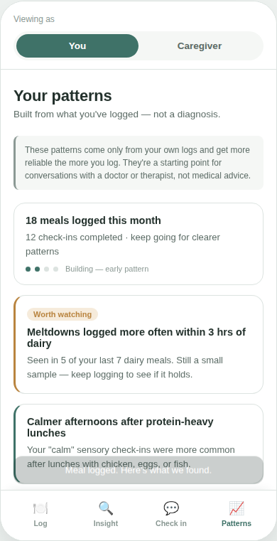
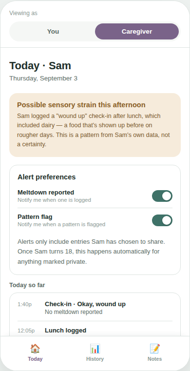
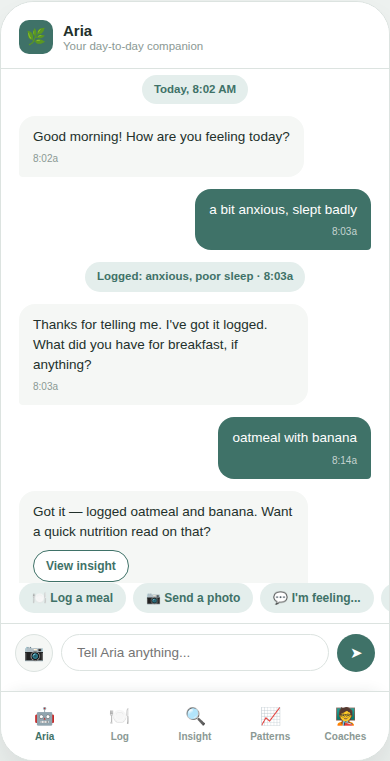
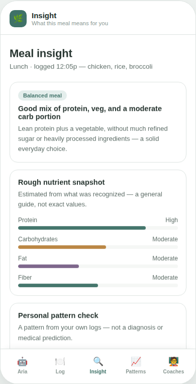
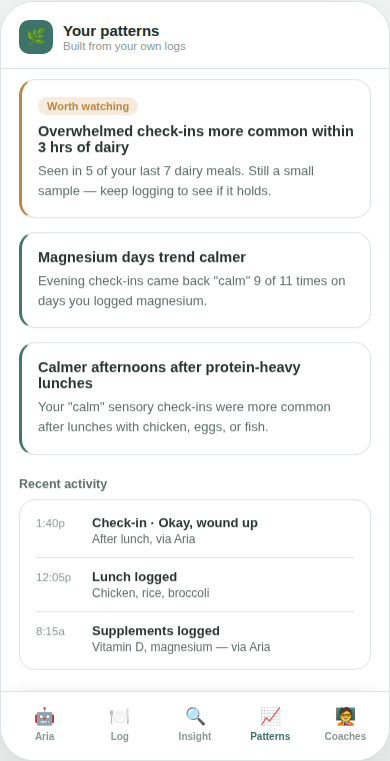
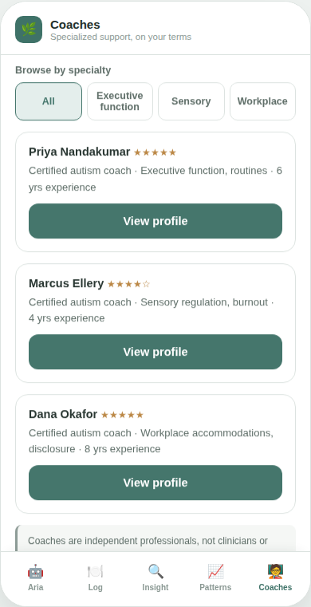

# Autism-Adjacent Wellness App — Prototypes

Two interactive, front-end-only prototypes exploring meal/mood pattern tracking, built
around one shared principle:

> Show people patterns from **their own** logged data, and treat everything the app
> surfaces as a conversation-starter with a doctor, therapist, or coach — never as a
> diagnosis, a risk score, or medical advice.

There is no backend, no real accounts, no real food recognition, and no real data
storage in either prototype. Everything is mocked in the browser.

---

## 1. Family version — child + caregiver

**[Live demo →](Alegzandra/https://alegzandra.github.io/meal-mood-tracker-prototype/)**

A meal/mood tracker built around a young user and their caregiver, with age-based
privacy: a caregiver sees everything for a minor's account by default, and the user
gets a per-entry privacy toggle once they turn 18, with caregiver alerts respecting
that automatically.

<table>
<tr>
<td></td>
<td></td>
<td></td>
<td></td>
</tr>
<tr>
<td align="center">Onboarding</td>
<td align="center">Meal insight</td>
<td align="center">Your patterns</td>
<td align="center">Caregiver: Today</td>
</tr>
</table>

[See all screenshots →](screenshots/)

## 2. Aria — for autistic adults

**[Live demo →](https://alegzandra.github.io/meal-mood-tracker-prototype/aria.html)**

A standalone, self-directed version built for autistic adults with lower support
needs. The centerpiece is Aria, a conversational assistant: tell it what you ate, what
supplement you took, or how you're feeling — in plain text or by photo — and it logs
it for you. It also proactively nudges ("did you drink water?", "time to stretch") and
surfaces patterns directly in the conversation.

<table>
<tr>
<td></td>
<td></td>
<td></td>
<td></td>
</tr>
<tr>
<td align="center">Aria (chat)</td>
<td align="center">Meal insight</td>
<td align="center">Your patterns</td>
<td align="center">Find a coach</td>
</tr>
</table>

[See all screenshots →](screenshots-aria/)

### What's different about Aria

- **No caregiver role.** The user is the only account — self-directed, self-reported.
- **Conversational logging first.** Manual forms (the Log tab) still exist as a
  fallback, but the primary interaction is talking to Aria.
- **Supplements are tracked alongside meals**, since diet isn't the only variable that
  plausibly matters for this audience.
- **A coach directory**, with an optional, clearly-labeled self-reflection screener to
  help someone figure out whether reaching out to a coach might be useful. The
  screener is illustrative only — a real version would use a properly validated,
  licensed instrument, administered with appropriate guidance on interpreting results.
- **No onboarding "diagnosis quiz."** Account setup asks about existing,
  professionally-made diagnoses (self-reported) — it does not attempt to assess or
  score autism traits or support needs itself. Support-level classification is a
  clinical judgment made by a qualified professional through interview and
  observation; no self-report tool, however well designed, can substitute for that.

## Design decisions worth calling out

- **"Pattern," never "risk" or "prediction."** Both prototypes avoid diagnostic or
  predictive medical language throughout — in the UI copy and in the underlying code
  (class names, IDs, function names), so there's no mismatch between what's shown and
  what's built. Software that predicts or informs prognosis of a health condition can
  fall under EU MDR (medical device) regulation depending on its intended purpose —
  both prototypes are scoped and worded to stay personal-analytics tools, not
  diagnostic ones.
- **Confidence is shown, not hidden.** Every pattern surfaced is paired with how much
  data it's based on, so a 2-data-point coincidence doesn't read the same as an
  18-data-point trend.

## Tech

Two self-contained HTML files — `index.html` and `aria.html` — no build step, no
dependencies, no backend. Vanilla HTML/CSS/JS, styled with CSS custom properties.

```bash
git clone <this-repo-url>
cd <repo>
open index.html   # family + caregiver version
open aria.html     # Aria, for autistic adults
```

## Status & roadmap

These are **design prototypes**, built to validate UX and product framing before
engineering the real thing. Not included here (by design — this is the part that stays
private pre-launch): the real backend, real food-recognition API integration, the
personal-pattern scoring model, push notifications, and coach verification/booking.

## License

See [LICENSE](LICENSE) — all rights reserved. Shared publicly for portfolio and
demonstration purposes; not licensed for reuse.
