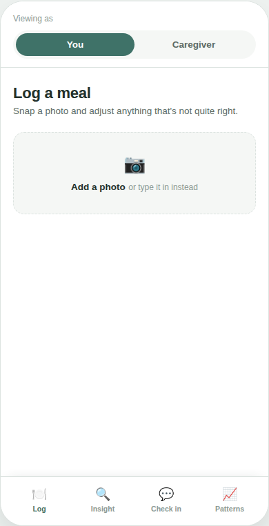
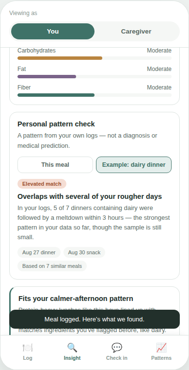
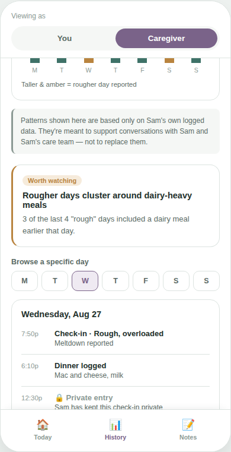
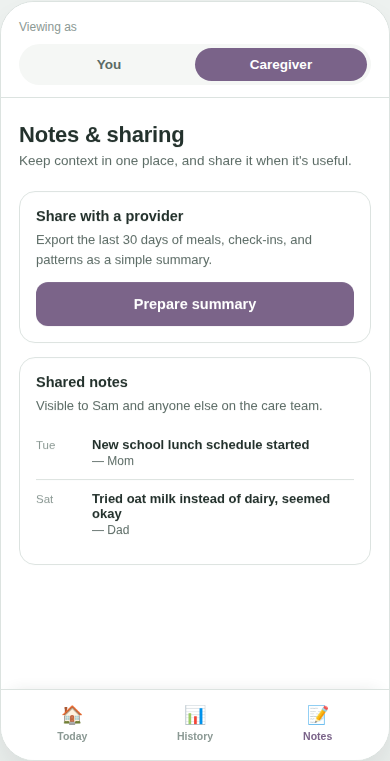

# Meal & Mood Pattern Tracker — Interactive Prototype

A clickable, front-end-only prototype for a mobile app that helps people (and their
caregivers) track meals alongside how they felt afterward, in order to surface
**personal, self-reported patterns** — not medical predictions.

**[Live demo →](https://alegzandra.github.io/meal-mood-tracker-prototype/) <!-- replace with your GitHub Pages URL once enabled -->**

> This repository contains the interactive UI prototype only. It's a design and UX
> artifact, not a production app: there's no backend, no real accounts, no real food
> recognition, and no real data storage. Everything is mocked in the browser.

---

## Why this exists

Early dietary/behavioral pattern research suggests food, sensory state, and mood can be
loosely linked for some people — but the evidence is early, individual variation is
large, and there is no validated formula that predicts a specific outcome from a meal.
This project deliberately does **not** try to be that formula. Instead, it's designed
around a narrower, more honest premise:

> Let each person build a picture of *their own* patterns, from *their own* logged data,
> and treat everything the app surfaces as a conversation-starter with a doctor or
> therapist — never as a diagnosis, a risk score, or medical advice.

That constraint shaped almost every product decision below.

## What's in the prototype

| Screen | What it shows |
|---|---|
| **Onboarding** | Account setup that collects date of birth (to drive age-based privacy defaults) and optional, self-reported diagnosis context — explicitly framed as personalization, never assessment |
| **Log a meal** | Mocked photo → food-recognition flow with editable ingredient chips |
| **Meal insight** | A plain-language nutrient snapshot and a "personal pattern check" — a match to the user's own historical logs, shown with sample size and confidence, never as a bare score |
| **Check-in** | Post-meal mood / sensory-comfort / meltdown logging, with a privacy toggle that only appears for adult accounts |
| **Patterns** | The user's own dashboard of patterns over time, with a visible confidence indicator tied to how much data exists |
| **Caregiver — Today** | A caregiver's view of the day, including an alert-preferences panel that respects the user's privacy settings |
| **Caregiver — History** | A day-by-day browser for past logs, with private entries shown as locked rather than hidden or leaked |
| **Caregiver — Notes** | Shared notes and a provider-facing summary export |

### Screenshots

<table>
<tr>
<td></td>
<td></td>
<td></td>
<td></td>
</tr>
<tr>
<td align="center">Onboarding</td>
<td align="center">Log a meal</td>
<td align="center">Meal insight</td>
<td align="center">Personal pattern check</td>
</tr>
<tr>
<td></td>
<td></td>
<td></td>
<td></td>
</tr>
<tr>
<td align="center">Your patterns</td>
<td align="center">Caregiver: Today</td>
<td align="center">Caregiver: History</td>
<td align="center">Caregiver: Notes</td>
</tr>
</table>

## Design decisions worth calling out

A few choices here were deliberate, not defaults — worth reading if you're evaluating
the product thinking rather than just the pixels:

- **"Pattern," never "risk" or "prediction."** Every surface avoids diagnostic or
  predictive medical language on purpose. Software that predicts or informs prognosis of
  a health condition can fall under EU MDR (medical device) regulation depending on its
  intended purpose — this app is scoped and worded to stay a personal-analytics tool,
  not a diagnostic one.
- **Age-aware privacy, not a blanket rule.** Caregivers see everything for a minor's
  account by default; once an account turns 18, the user gets a per-entry privacy toggle
  and caregiver alerts automatically respect it.
- **Confidence is shown, not hidden.** Every pattern the app surfaces is paired with how
  much data it's based on, so a 2-data-point coincidence doesn't read the same as an
  18-data-point trend.
- **No onboarding "diagnosis quiz."** The account setup asks about existing,
  professionally-made diagnoses (self-reported) — it does not attempt to assess or score
  autism traits itself. That's a clinical judgment, not something a quiz can validly
  produce.

## Tech

Single self-contained `index.html` — no build step, no dependencies, no backend.
Vanilla HTML/CSS/JS, styled with CSS custom properties. Open it directly in a browser,
or serve the repo with GitHub Pages.

```bash
git clone <this-repo-url>
cd <repo>
open index.html   # or just double-click it
```

## Status & roadmap

This is a **design prototype**, built to validate the UX and product framing before
engineering the real thing. Not included here (by design — this is the part that stays
private pre-launch): the real backend, real food-recognition API integration, the
personal-pattern scoring model, and push notifications.

## License

See [LICENSE](LICENSE) — all rights reserved. This is shared publicly for portfolio and
demonstration purposes; it isn't licensed for reuse.
